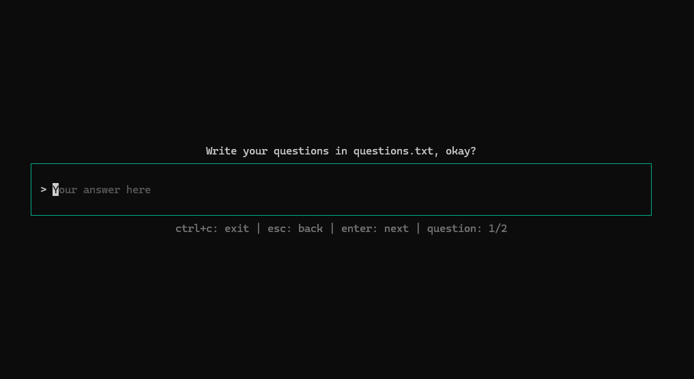
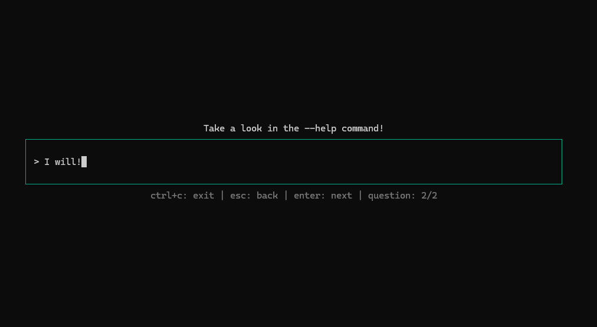
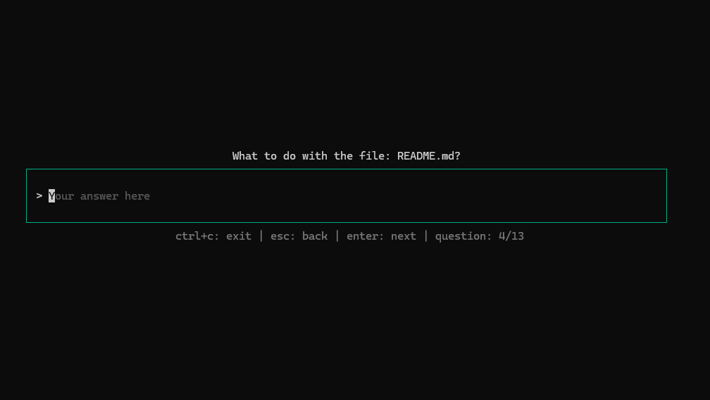
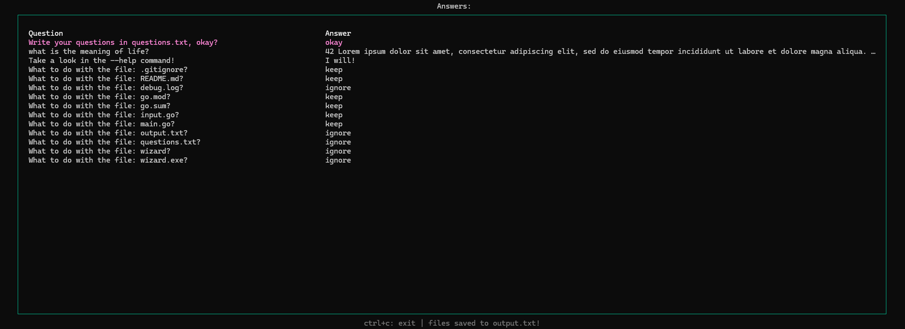
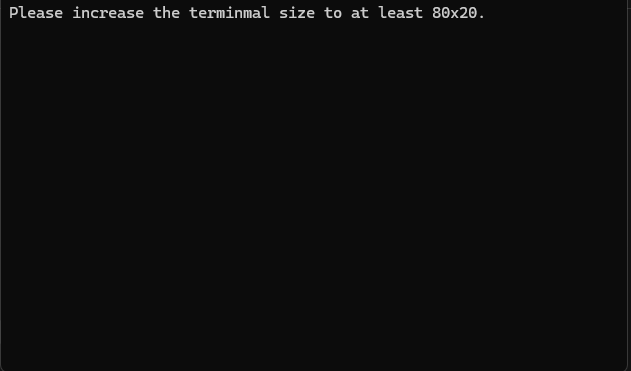

# Bubbletea wizard

Projeto simples, pensado para auxiliar na revisão de arquivos locais e criação de quiz localmente.

## ✨ Funcionalidades: 

- **Criação de questões simples e longas**: Ao preencher o arquivo de questões, o usuário pode criar questões com respostas em texto;
- **Visualização e exportação das respostas**: Após o preenchimento, o usuário pode visualizar as respostas e exporta-las automaticamente;
- **Auto gerenciamento de binários**: A aplicação identifica ao ser iniciada em um certo sistema, e se auto inicia em um novo terminal caso seja executada fora do ambiente ideal.

## 🛠 Tecnologias Utilizadas

- **Golang+**
- **BubbleTea** 

## ⚙️ Instalação local
### Pré-requisitos
Certifique-se de ter os seguintes itens instalados em sua máquina para buildar o programa:

- Golang 1.23

Clone o projeto: 
```bash
git@github.com:eduardo-moro/bubbletea-wizard.git
cd bubbletea-wizard
```

Instale as dependências: 
```bash
go mod tidy
```

Faça o build do projeto:
```bash
go build .
```

Rode o projeto:
```bash
./wizard.exe //windows
```

```bash
./wizard //linux
```

uso do programa:
```bash
./wizard [OPTION] [LIST PATH] [QUESTIONS PATH]
  -l --list
        Diretório à ser listado
  -q --questions
        Path para o arquivo questions.txt
  -r    
        Ativar busca recursiva por arquivos.
```

O arquivo questions.txt deve ser manipulado da seguinte forma:
```txt
//Comentários
Perguntas comuns
*Perguntas com respostas longas
>Pergunta sobre os arquivos à serem examinados (Só é nescessário uma utilização)
//os simbolos //, * e > são responsáveis pela diferenciação de cada linha do arquivo, não é nescessário espaçar o simbolo do resto da questão.
```

## 📷 Prints do projeto:







]





<div align="right">
    <span>Feito com ❤️.</span>
</div>
